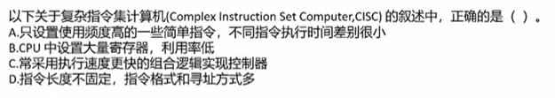

## 1.1 计算机硬件
### 1.1.1 计算机硬件组成
- 运算器
- 控制器
- 存储器
- 输入设备
- 输出设备
### 1.1.2 中央处理单元
1. 程序控制
2. 操作控制
3. 时间控制
4. 数据处理
   1. 数据算数运算和逻辑运算
5. cpu还需要对系统内部和外部的中断(异常)做出响应,进行相应处理
### 1.1.3 cpu的组成
1. 主要由运算器 控制器 寄存器 和内部总线组成
2. 寄存器一般是32位 64位等
3. 运算器四个部件
   1. 算数逻辑单元ALU (逻辑运算和算术运算)
   2. 累加寄存器AC (运算结果或运算操作数的存放区)
   3. 数据寄存器DR (运算操作数的存放区)
   4. 状态条件寄存器SCR (控制cpu执行指令的寄存器 如溢出标志等)
4. 控制器四个部件
   1. 指令寄存器IR (指令的存放区)
   2. 程序计数器PC (存放指令执行地址)
   3. 地址寄存器AR (保存当前cpu所访问的内存地址)
   4. 指令编译器ID (分析指令的操作码)
5. cpu根据指令的不同阶段来区分二进制的指令和数据
### 1.1.4 校验码
1. 码距
   1. 两个编码中， 从A码转化到B码做需要改变的位数称为码距 码距越大 越利于纠错和检错
2. 奇偶校验码
   1. 码距是2
   2. 整个表达式有奇数个1 就是奇校验 偶数个1 就是偶校验
3. CRC循环冗余校验码
  1. 只能检错 不能纠错 能检多位错

  题解：
      1. 先根据生成多项式幂数补齐0 题目信息为1100 生成多项式为x^3+x+1 幂数为3 故：补完信息值为1100000
      2. 再用补完的值 与生成多项式的值 做模2运算
      x^3+x+1 = 1011 算式 1100000 / 1011 = 111000 / 1011 = 1010 / 1011 = 10
      3. 得到11 在根据幂数左补齐0 最终验证码为 010
      4. 再加上原始值 最终为1100010

## 1.2 指令系统
1. 计算机指令组成
   1. 一般由操作码和操作数来组成
   2. 操作码存放要执行的操作 比如加减乘除
   3. 操作数存放要执行操作的地址
2. 计算机指令执行过程
   1. 取指令 -- 分析指令 -- 执行指令
3. 指令寻址
   1. 顺序寻址
   2. 跳跃寻址 地址不是由程序计数器给出 而是由本条指令直接给出
4. 指令操作数的寻址方式
   1. 立即寻址方式 地址码指向操作数本身
   2. 直接寻址方式 地址码指向操作数的地址
   3. 间接寻址方式 地址码存的一个转换 转换指向操作数的地址
   4. 寄存器寻址方式 指令中的地址码是寄存器的编号
   5. 基址寻址方式
   6. 变址寻址方式
5. SISC是复杂指令系统
   1. 兼容强 指令多 长度可变 由微程序实现
6. RISC是精简指令系统
   1. 指令少 频率接近 主要依靠硬件实现
7. 真题
   1. 题目1

答案A D
   2. 题目2

答案是D  B中精简指令系统会用到大量寄存器

8. 指令流水线原理：
   1. RISC流水线技术
      1. 超流水线 细化流水提高主频 以时间换空间
      2. 超标量 加硬件设备 多核执行 以空间换时间
      3. 超长指令字 用原件手段 用空间换时间
   2. 流水线时间计算
      1. 流水线周期 流水线执行时间最长的一段
      2. 流水线执行时间 1条指令执行时间 + (总指令条数-1) * 流水线周期
      3. 流水线吞吐量：单位时间内执行的指令条数 指令条数/流水线执行时间
      4. 流水线加速比计算 不使用流水线时间/使用流水线执行时间
9. 真题
   1.  题目1

题解： 流水线的执行时间为 
  一条指令执行时间 2+1*4=6
  总条数 100
  流水线周期 2
  套入公司 100 / 6 + (100-1)*2 = 0.49
  答案: B

   2.  题目2

注：只有双缓冲区及以上 是三段执行 套用公式为156
    单缓冲区不能并行 故答案是201

   3.  题目3

  答案 B A
  假设n 无穷大的时候 加速比最大 不使用流水线的时候 总时长时36n  使用流水线总时长时9n +27 36n/9n + 27 = 4

## 1.3 存储系统
计算机主要采用分级存储 从上到下速度越来越慢 容量越来越大 分别是
1. cpu内部通用寄存器 位级别
2. cache高速缓冲寄存器 辅存 M级别
3. 主存储器 内存G级别
4. 联机磁盘存储器 硬盘固态T级别
5. 脱机光盘 磁盘存储器 移动硬盘T级别

- 局部性原理
以为cpu运行速度过快 等待内存返回数据过慢 加了一个辅助缓存 速度会比内存快十几倍 
- 时间局部性原理：如果一个数据正在被访问 那么它近期很有可能再次被访问 即相邻的时间里会访问同一个数据项
- 空间局部性原理：如果近期访问的数据地址和现在访问的数据地址很相近 那相邻的空间地址很有可能会被连续访问
- cache用来存储当前最活跃的程序和数据 直接与cpu交互 位于cpu和主存之间由半导体材料构成
- cache由控制部分和存储器组成
- cache采用地址映射 cpu发出的事内存地址 从cache读写数据 将内存地址转为cache地址由硬件自动完成
  - 直接映射 要求块号相同 将内存根据cache大小分为数个区1G内存1M的cache就会分为1024个区 cache和内存的每个区都会对应生成相同的块 两者块号相同就会命中 可能命中多个区 地址变换简单不灵活 容易造成资源浪费
  - 全相连映射：主存分为n块 内存中任意一块都会有cache任意一块对应 可以随意调入cache的位置 地址变换复杂 速度慢 是最不容易发生块冲突的映射
  - 组组相连映射 前两种映射的结合 先分块再分组 组号采用直接映像组内采用全相连映像
  - 替换算法 目标使cache获得尽高命中率
    - 随机替换
    - 先入先出算法
    - 最近最少使用算法 (目前最多) 
    - 优化替换算法 限执行一次 统计cache使用情况 再替换
  - 命中率及平均时间
    - cpu读取一次的平均时间 为命中率*cache时间 + 剩余命中率 * 内存时间
6. 真题
   1. 题目1

答案 B
   2. 题目2

答案 D

## 1.4 磁盘